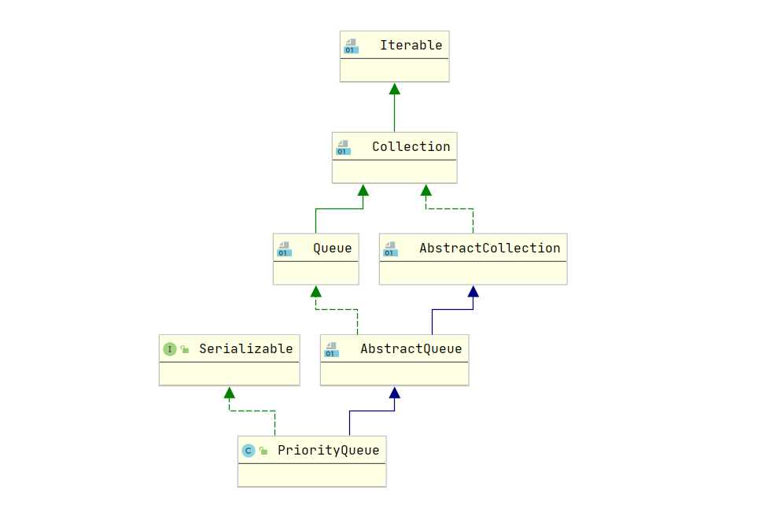
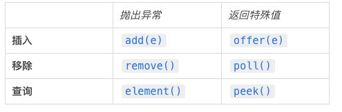

# 栈和队列

JAVA中的栈和队列使用  Deque<E> 接口来实现。

实现类有LinkedList<E>


```java
//构造函数
Deque<Integer> deq = new LinkedList<Integer>();

//Deque相关接口
//有关栈的接口、不建议使用。

//不需要从头到尾遍历的情况
//元素 入栈
deq.push(obj);

//元素 出栈， 返回出栈的元素
Object obj = deq.pop();

//返回 下一个出栈的元素，但是不出栈。
Object obj = deq.peek();


//需要遍历的情况
//元素 入栈
deq.offer(obj);

//元素 出栈
Object obj = deq.pollLast();

//返回 下一个出栈的元素
Object obj = deq.peekLast();

//遍历
for(Object obj:deq){
    //遍历逻辑代码
}


//有关队列的接口
//元素 入队
deq.offer(obj);

//元素 出队
Object obj = deq.poll();

//返回 下一个出队的元素，但是不出队
Object obj = deq.peek();


//有关双向队列的接口
//元素 正常 从队尾 入队列     这时 offer(obj) 与 offerLast(obj) 效果相同
deq.offer(obj);
deq.offerLast(obj);

//元素 从队头 入队列
deq.offerFirst(obj);

//元素 正常 从队头 出队列 	这时 poll(); 与 pollFirst(); 效果相同
Object obj = deq.poll();
Object obj = deq.pollFirst();

//查看下一个 从队头 出列的元素
Object obj = deq.peek();
Object obj = deq.peekFirst();


//元素 从队尾 出队列
Object obj = deq.pollLast();

//查看下一个 从队尾 出列的元素
Object obj = deq.peekLast();


```


这里的deque中的 栈方法 实际上是一个开口 朝左 的 栈

入栈出栈都从左边进入，因而右边的数据是最早进入LinkedList的


而 队列 的逻辑则是正常的，从右边进入 LinkedList, 然后从左出


# 优先级队列 - PriorityQueue< T >

顾名思义，进入队列的元素并不是先进先出的，而是需要先排序然后排在前面的先出队。

[(25条消息) Java 优先级队列_java 优先队列_WYSCODER的博客-CSDN博客](https://blog.csdn.net/sheng0113/article/details/123140959)

**继承关系:**



**接口实现：**

其实现了Queue接口，同时Queue接口又是Collection接口的一个实现类，因此具有两种方法对数据进行增删查看。区别如下：



第一列在异常时会抛出一个异常，而第二列在异常时会返回一个特殊值-1.


**常用方法**：

```java
//构造方法
//为优先级队列实现 比较器 接口
PriorityQueue(Comparator<? super E> comparator);

//将一个 Collection实现类变成优先级队列
PriorityQueue(Collection<? extends E> c);

//使用元素自带的Comparable 接口 的 compareTo方法 进行比较
PriorityQueue();

//常用方法

offer(obj), poll(), clear(), peek(),

```


## Comparable 接口 与 Comparator 接口


### Comparable 接口 (可比较的实体)

Comparable 是 实体类 需要实现的接口。

实现这个接口后，重写 **compareTo**方法 后，这个对象可以直接比较。

> 例如新建一个Student类，实现 Comparable接口后 重写compareTo方法，可以比较 stu1 > stu2

```java
//这里的泛型T可以为Object或者Student
int compareTo(T o);

//e.g. 从小到大排列    
public int compareTo(Object o) {
        Student o1 = (Student)o;
        return this.id - o1.id;
    }

//这个函数的参数 表示 其他的 实体o， 如果返回 正整数表示 this 实体比 o大，返回复数表示比 o 小，返回0 表示和o相等。
//注意这个方法是要实现在Class Student中的，因此可以调用 this.id进行比较。
//SortedSet 和 Queue中默认元素从小到大排列。

以上示例的结果是 12345。

```


### Comparator 接口(比较器)

当我们想要为一个Set或者Queue中的实体类排序，但是实体类并没有实现Comparable接口。

就需要我们实现Set或者Queue中的Comparator中的 **compare** 方法。

```java
//这里的泛型T可以为Object或者Student
int compare(T o1,T o2);

//返回 整数则 排在后面， 返回负数排在前面， 返回0则不进入。  
//o1表示待进入元素    o2表示Queue中的各个已有元素
public int compare(Student o1, Student o2) {
                return o2.getId() - o1.getId();
            }
```


