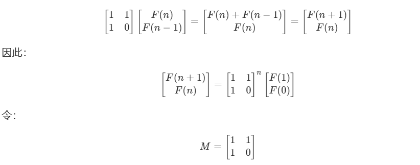

# 矩阵快速幂

[剑指 Offer 10- I. 斐波那契数列 - 力扣（LeetCode）](https://leetcode.cn/problems/fei-bo-na-qi-shu-lie-lcof/)

**背景**：求一个数 x 的 n 次方。

**幂** 指 的是 xx 次方

**快速幂** 指的是 快速求一个数的 xx 次方

**矩阵快速幂** 指的就是 把数换乘矩阵。

使用的方法就是分治法：

问题的关键就是需要把递推函数 构造成 快速幂的形式。

    class Solution {
        static final int MOD = 1000000007;
        
    
        public int fib(int n) {
            if (n < 2) {
                return n;
            }
            int[][] q = {{1, 1}, {1, 0}};
            int[][] res = pow(q, n - 1);
            return res[0][0];
        }
    
        public int[][] pow(int[][] a, int n) {
            int[][] ret = {{1, 0}, {0, 1}};
            while (n > 0) {
                if ((n & 1) == 1) {
                    ret = multiply(ret, a);
                }
                n >>= 1;
                a = multiply(a, a);
            }
            return ret;
        }
    
        public int[][] multiply(int[][] a, int[][] b) {
            int[][] c = new int[2][2];
            for (int i = 0; i < 2; i++) {
                for (int j = 0; j < 2; j++) {
                    c[i][j] = (int) (((long) a[i][0] * b[0][j] + 
                    				(long) a[i][1] * b[1][j]) % MOD);
                }
            }
            return c;
        }

