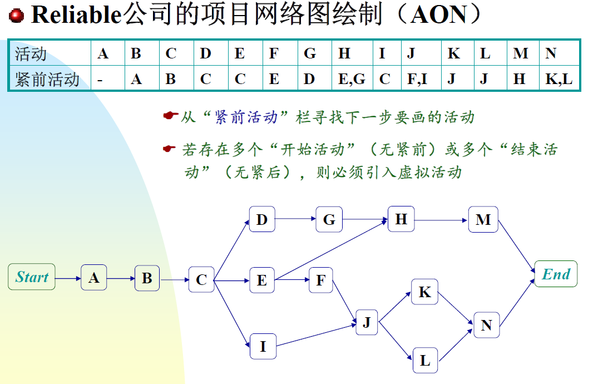

# 拓扑排序

**概述**

在一个拓扑网络中给点进行排序，每个点或许存在紧前任务。

**算法步骤**

1. 在表中找到没有紧前任务的 任务，作为起始任务。
2. 进行完起始任务之后更新紧前任务表，然后再找没有紧前的任务。

[207. 课程表 - 力扣（LeetCode）](https://leetcode.cn/problems/course-schedule/)

**代码模板**

1. 生成一个入度数组 **indegree[n]** 作为遍历的依据
1. 初始化一个**List<List< Integer >> adjacency** 表示每个点的出度，遍历后将每个出度点的入度数组减一
1. 初始化一个队列 **que**，遍历数组，先将所有入度为0的点加入。在遍历点后，继续将入度为0的点加入数组继续遍历。
1. while循环直到que中不存在点，可以看看循环了多少次。如果不等于点数，那么就存在环。

