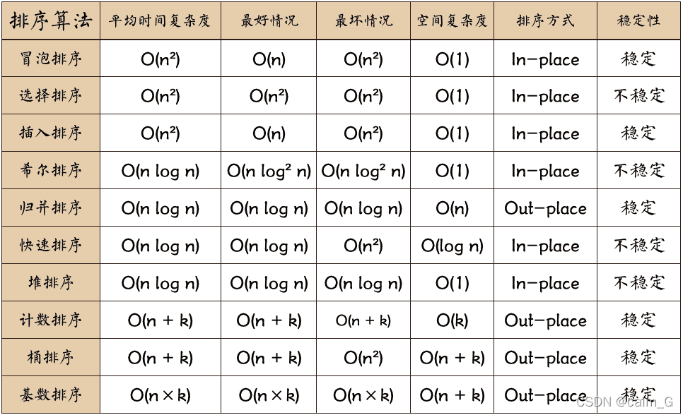
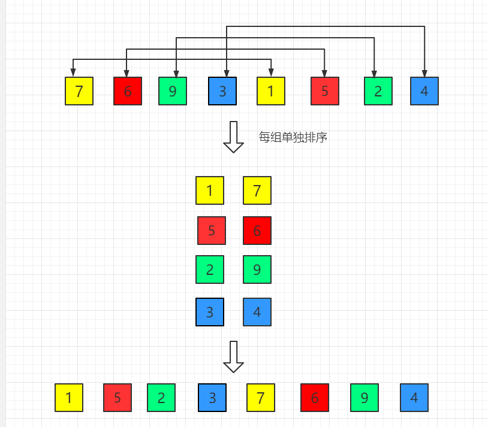
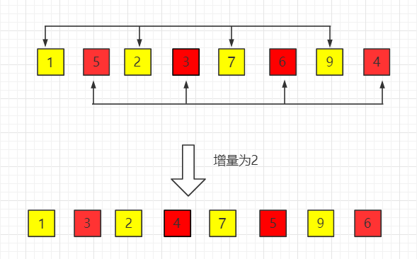
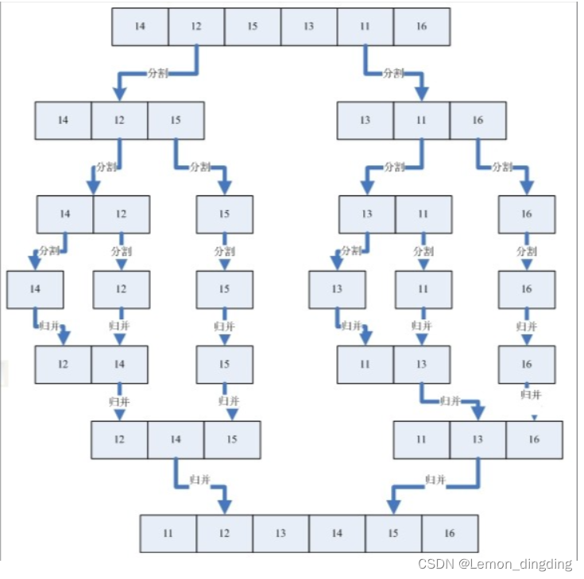
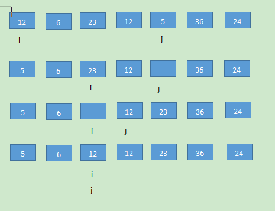
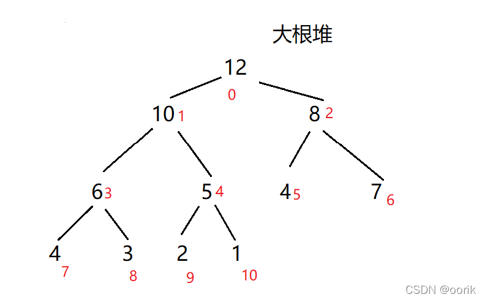
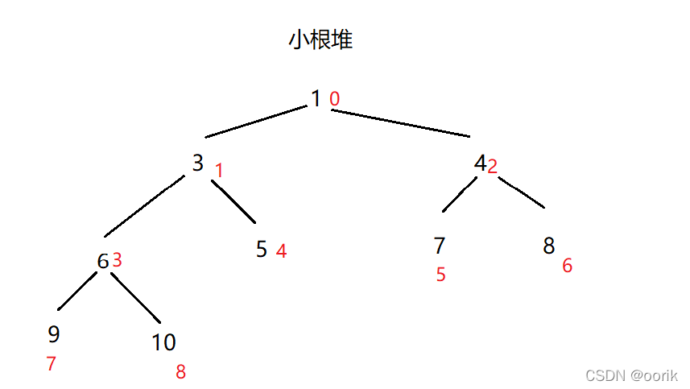
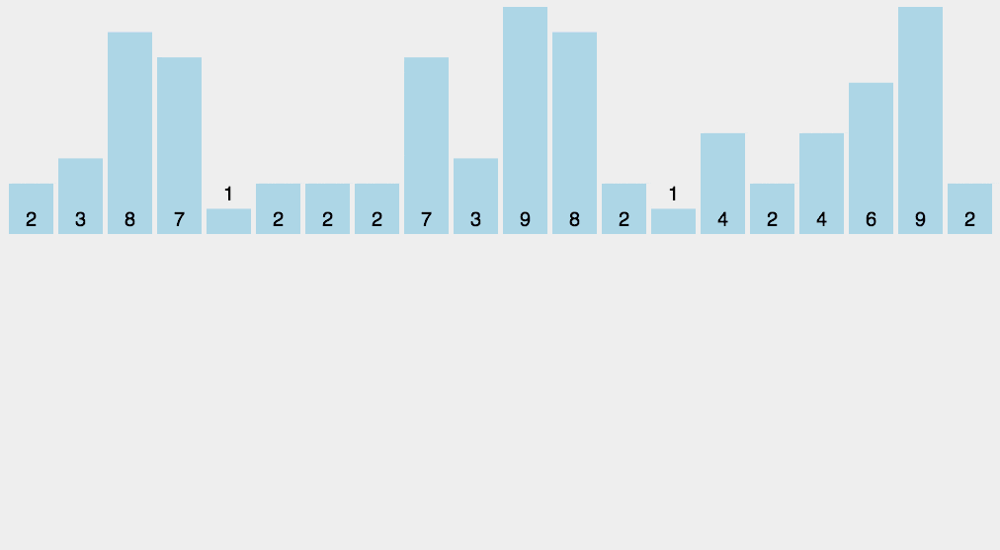

# 排序算法

十大排序算法

> 一般情况下，称某个排序算法稳定，指的是当待排序序列中有相同的元素时，它们的相对位置在排序前后不会发生改变。




## 冒泡排序

**算法步骤**

每次从头开始向后 一一比较，将较大的数后移一位。第 i 次可以确定 第(n - i)索引的数。每一次可以找到最大的数。


**代码**

```java
    public void bulb_sort(int[] arr){
		//flag用于判断停止
        boolean flag = true;
        for(int i = 0; i < arr.length ; i++){
            if(flag == false) break;
            flag = false;
            for(int j = 0; j < arr.length - i - 1; j++){
                if(arr[j] > arr[j+1]){
                    int temp = arr[j];
                    arr[j] = arr[j + 1];
                    arr[j + 1] = temp;
                    flag = true;
                }
            }
        }
```


## 选择排序

**算法概述**

从前到后遍历每次选择最小的数放到 i 的位置


```java
    public void select_sort(int[] arr){
		//每次只更改i位置的数
        for(int i = 0; i < arr.length; i++){
            int min_value = arr[i];
            for(int j = i; j < arr.length; j++){
                if(arr[j] < min_value){
                    min_value = arr[j];
                    arr[j] = arr[i];
                    arr[i] = min_value;
                }
            }

        }
```


## 插入排序

**算法概述**

i 从前向后遍历, 取得 i 的值，从后向前遍历，以此比较将其插入有序队列中。


代码

```java
//第一版
	public void insert_sort(int[] arr){
        for(int i = 1; i < arr.length; i++){
            for(int j = i; j > 0; j--){
                if(arr[j] < arr[j - 1]){
                    int temp = arr[j - 1];
                    arr[j - 1] = arr[j];
                    arr[j] = temp;
                }else{
                    break;
                }
            }
        }
    }
//优化

    public void insert_sort2(int[] arr){
        for(int i = 1; i < arr.length; i++){
            //在这里直接存储本轮要判断的值
            int now = arr[i];
            //这里j从i - 1 一直到0
            int j = i - 1;
            //连续比较中间不需要重新赋值
            for(; j >= 0; j--){
                if(now < arr[j]){
                    arr[j + 1] = arr[j];
                }else{
                    break;
                }
            }
            
            arr[j + 1] = now;
        }
    }


```


## 希尔排序

**算法概述**

希尔排序是插入排序的优化，就是将整个数组以 gap  = arr.length / 2为间隔分组，每组进行排序。主键缩短gap = gap / 2  最后进行完全插入排序。

**图示**

gap较小的分类



之后gap会越来越小，逐渐到1.




**代码**

```java
//外层多一个循环，记录gap,从arr.length / 2一直到1
//注意内层j每次遍历都要 减一个gap , 同时赋值也要赋 arr[j+gap]
	public void shell_sort(int[] arr){

        for(int gap = arr.length; gap > 0 ; gap /= 2){

            for(int i = gap; i < arr.length; i++){
                int j = i - gap;
                int temp = arr[i];
                for(; j >= 0 ; j -= gap){
                    if(temp < arr[j]){
                        arr[j + gap] = arr[j];
                    }else{
                        break;
                    }
                }
                arr[j + gap] = temp;
            }
        }
    }

```


## 归并排序

归并排序就是使用 **递归** 的方法将数组每一部分分成两半，最后分到只有一个值，然后在原路重新排序回去。

两组有序数组重新排序的过程 就是 一直找两个数组的最小值成为



**代码**

代码分为两部分，分与合

分的过程就是不断二分直到一个值

合的过程就是一直找两个数组最小值

```java
    public void merge_sort(int[] arr, int left, int right){
        if(left >= right){
            return;
        }
        int mid = left + (right - left) / 2;
        merge_sort(arr,left,mid);
        merge_sort(arr,mid + 1,right);
        merge(arr,left,mid+1,right);
    }

    public void merge(int[] arr, int left_poi, int right_poi, int right_end){
        int i = left_poi;
        int j = right_poi;

        int left_end = right_poi - 1;

        int[] temp = new int[right_end - left_poi + 1];
        int k = 0;

        while(i <= left_end && j <= right_end){
            if(arr[i] <= arr[j]){
                temp[k] = arr[i];
                i++;
                k++;
            }else{
                temp[k] = arr[j];
                j++;
                k++;
            }
        }

        while(i <= left_end){
            temp[k] = arr[i];
            i++;
            k++;
        }

        while(j <= right_end){
            temp[k] = arr[j];
            j++;
            k++;
        }

        for(k = 0; k < temp.length; k++ ){
            arr[left_poi + k] = temp[k];
        }
        return;
    }


```


## 快速排序

**概述**

快速排序就是从头到尾遍历， 先将索引为 i 的数放在它应该在的位置，然后将数组左右分开，继续递归。


**图解**

这里的图并不是特别准确。

但是要确定一点就是先动右指针再动左指针

停下之后要保证 **左指针** < **右指针** 的前提下互换值。

这样在 **左右指针重合** 之后再最后调换数组头部值。




**代码**

使用双指针法来将指定值左右的数分开。

注意遍历的时候加上  ( l < r &&  val <= arr[r]) 一定要注意前面的条件来保证左指针在右指针左面。

```java
    public void quick_sort(int[] arr, int begin, int end){
        if(begin >= end){
            return;
        }

        int l = begin;
        int r = end;
        int val = arr[begin];
        while(l < r){
            while(l < r && val <= arr[r]){
                r--;
            }


            while(l < r && val >= arr[l]){
                l++;
            }

            if(l < r){
                int temp = arr[l];
                arr[l] = arr[r];
                arr[r] = temp;
            }
        }
        arr[begin] = arr[l];
        arr[l] = val;

        if(begin < l){
            quick_sort(arr,begin,l - 1);
        }


        if(r < end){
            quick_sort(arr,r + 1, end);
        }

    }


```


## 堆排序

**概述**

将数组视作一个堆(大顶堆 或 小顶堆)，维护堆，然后取根节点即可。

[排序算法：堆排序【图解+代码】_哔哩哔哩_bilibili](https://www.bilibili.com/video/BV1fp4y1D7cj/?spm_id_from=333.337.search-card.all.click&vd_source=21b940b8c0153340bd9744b996376bbd)

**算法步骤**

前置步骤：

* 当前节点 **i** 的父亲节点 (i - 1) / 2
* 当前 节点的 **左孩子** i * 2 + 1
* 当前 节点的 **右孩子** i * 2 + 2

1. 将数组视作一个大顶堆或小顶堆。
2. 维护数组大顶堆或小顶堆的性质。从最后一个 非叶子节点开始向前维护。
3. 将根节点取下，放入数组。 在最后一个叶子节点放入根节点然后继续维护。
4. 重复3的步骤直到数组所有全部完成。


**大顶堆**



**小顶堆**



**代码示例**

1. 先建堆
2. 抽取根节点
3. 重新建堆，同时将最大索引 减一
4. 重复 2.3 直到最大索引为0

```java

	public void heap_sort(int[] arr){

        heapfy(arr, arr.length -1, arr.length - 1);
        for(int i = arr.length - 1; i >= 0; i--){
            int temp = arr[i];
            arr[i] = arr[0];
            arr[0] = temp;
            heapfy(arr, i, i);
        }


    }


    public void heapfy(int[] arr, int n, int i){
        //n表示最大索引， i 表示当前维护的节点
            if(i < 0) return;

            int largest = i;
            int lson = i * 2 + 1;
            int rson = i * 2 + 2;
            if( lson < n  && arr[largest] < arr[lson]){
                largest = lson;
            }

            if( rson < n && arr[largest] < arr[rson]){
                largest = rson;
            }

            if(largest != i){
                int temp = arr[largest];
                arr[largest] = arr[i];
                arr[i] = temp;
            }

            heapfy(arr, n, i - 1);

    }


```


## 计数排序

**概述**

根据nums[] 所有元素差值，申请一个长度为差值的 values[]数组，遍历一遍Nums[]在对应位置++.最后遍历values[], 重构排序nums[]数组。 

要求：必须是整数，最大值和最小值不能相差过大。


**图示**

时间复杂度O(n + k)

空间复杂度O(K)




**代码实现**


```java
    public void counting_sort(int[] arr){
        int[] diff = getDif(arr);
        int[] counting = new int[diff[0] - diff[1] + 1];

        //计数
        for(int num :arr){
            counting[num - diff[1]]++;
        }


        //排序
        int index = 0;
        for(int i = 0; i < counting.length; i++){
            for(int j = 0; j < counting[i]; j++){
                arr[index++] = i + diff[1];
            }
        }


    }

    public int[] getDif(int[] arr){
        int minValue = arr[0];
        int maxValue = arr[0];
        for(int i:arr){
            if(minValue > i){
                minValue = i;
            }
            if(maxValue < i){
                maxValue = i;
            }

        }
        int[] res = {maxValue, minValue};
        return res;
    }


```


## 桶排序


## 基数排序


