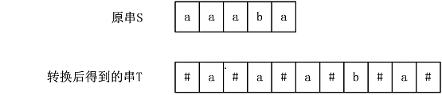
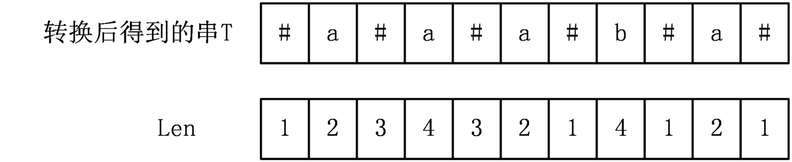

# 最长回文串

[647. 回文子串 - 力扣（LeetCode）](https://leetcode.cn/problems/palindromic-substrings/)

**问题描述**

求一个字符串回文串个数

## 暴力算法

**概述**

先找到字符串中的所有回文中心(可能是1个或者2个字符)。

然后使用双指针从中间向两边进行判断直到最长回文串长度为止。

**代码**

确定左右指针然后双指针法。

```java
public int countSubstrings(String s) {
        int res = 0;
        for(int i = 0; i < s.length() * 2 + 1; i++){
            int left = i / 2; int right = i / 2 + i % 2;
            while(left >= 0 && right < s.length() && s.charAt(left) == s.charAt(right)){
                left--;
                right++;
                res++;
            }

        }
        return res;
}
```


## Manacher算法

**概述**

将字符串 每个字符之间用 **特殊字符** 分割，将所有字符串变成新的 奇数字符串。然后求最长回文串长度。

正常暴力求解 时间复杂度为 O(n3)

该算法为O(n)。

**算法步骤**

* **基本原理**

1. 先根据原字符串得到新的字符串



2. 根据新的字符串需要最终得到 Len 数组， Len[i] 表示i位置上回文串半径(包含T[i]自己本身)。 可以证明 Len[i] - 1 = 原字符中 **字符i** 回文串长度.



* **Len数组求解过程**

  1. L[0] = 1

  2. 要记录回文子串到达字符串最右边的位置索引 k 即  k + L[k] + 1 = max(  i + L[i] + 1 )  =  r , 2k - r = l.即记录最远 回文子串 的 **中心索引** 以及 **两端索引**。

  3. 遍历 i 时分为两种情况,遍历过后记得更新 k 和 r , l 的值

     * i > r

       直接暴力更新，参考 **暴力算法**

     * i <r

       

       如下图所示，其中红色和橙色部分是相同的，找到 **i** 关于 **k** 的对称位置，即 **j**（其中j = 2 ∗ k − i ），由于k是对称中心位置，那么判断一下 **L[ j ]** 与 **r − i** 的大小关系

       *  L[j] <= r - i:

         r - i 也就是 j - l 关于 k 对称，因此等长。 j 为中心的最长回文串并没有越过 K 界。那么 L[i] = L[j], 因为对称关系。   

       

       * L[j] > r - i

         超过 K 界线的部分需要暴力。 也就是 i 的 **右指针** 至少到 r。

       

       

**代码**


```java
    
public int countSubstrings(String s) {
		//构造新字符串
        int n = s.length();
        StringBuilder sbu = new StringBuilder("@$");
        for(int i = 0; i < n; i++){
            sbu.append(s.charAt(i));
            sbu.append('$');
        }
        n = sbu.length();
        sbu.append('!');

    	//初始化 k, r, res
        int[] Len = new int[n];
        int k = 0, r = 0, res = 0;
        for(int i = 1; i < n; i++){
            //初次判定 i 与 r 的关系， 初步判定 Len[i]
            Len[i] = i <= r ? Math.min(Len[2 * k - i], r - i + 1) :1;
			
            //左右暴力搜索回文
            while(sbu.charAt(i - Len[i]) == sbu.charAt(i + Len[i])){
                Len[i]++;
            }
			//更新 k 和 r
            if(r < i + Len[i] - 1){
                k = i;
                r = i + Len[i] - 1;
            }

            res += Len[i] / 2;

        }
        return res;
    }
```


