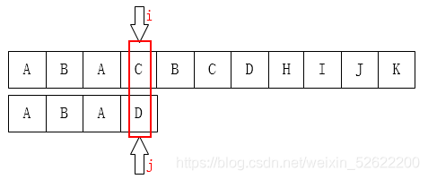
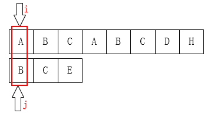
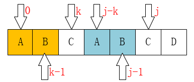

# 字符串匹配

[28. 找出字符串中第一个匹配项的下标 - 力扣（LeetCode）](https://leetcode.cn/problems/find-the-index-of-the-first-occurrence-in-a-string/)

给一个长字符串 haystack

给一个短字符串needle 

返回 haystack 中 和needle **完全匹配** 的 第一个字符的下表


## KMP算法

**概述**

为 needle 维护一个 next数组，表示索引 i 不匹配时 跳转的位置。 

然后 从前向后 遍历 haystack 匹配。


**算法步骤**

1. 遍历haystack 和 needle ，如果遇到不匹配的 字符，那么根据 next数组，i不变，j退回next[j]重新匹配，直到 next = -1



获取**next数组**步骤

1. 当 j = 0 时，如果不匹配,这时候 j 退无可退，下一步需要 i++.因此next[j] = -1



2. 当 j != 0 的时候，j 应该退回 next[j] = k 继续匹配， 如图 j 前面 AB 对应了前面的AB，所以应该从 j = 5 跳转到 k = 2,因为前面都有 **最长相等前后前后缀** AB。

   

3. 在j = 0， k = -1 后，j++ k++, 如果 needle[j] == needle[k],那么 next[j] = next[j - 1] + 1. 即 next[j] = ++k
4. 如果needle[j] != needle[k],  k = next[k], 继续比较 needle[j] 与 needle[k]直到相等或者 k = -1   


**代码**


```java
public int strStr(String haystack, String needle) {
        int[] next = getNext(needle);
        int i = 0, j = 0, res = 0;

        while(i < haystack.length() && j < needle.length()){
            if(j == -1 || haystack.charAt(i) == needle.charAt(j)){
                i++;
                j++;
            }else{
                j = next[j];
            }

        }
        if(j == needle.length()){
            return i - j;
        }else{
            return -1;
        }


    }

    public int[] getNext(String needle){
        int len = needle.length();
        int[] next = new int[len];
        next[0] = -1;
        int j = 0, k = -1;
        while(j < len - 1){
            if(k == -1 || needle.charAt(j) == needle.charAt(k)){
                j++;
                k++;
                next[j] = k;
            }else{
                k = next[k];
            }
        }
        return next;
    }


```


