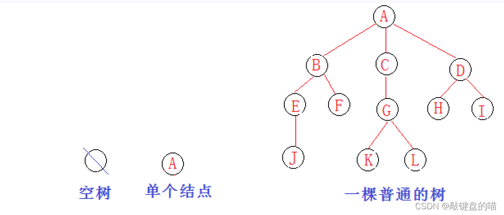
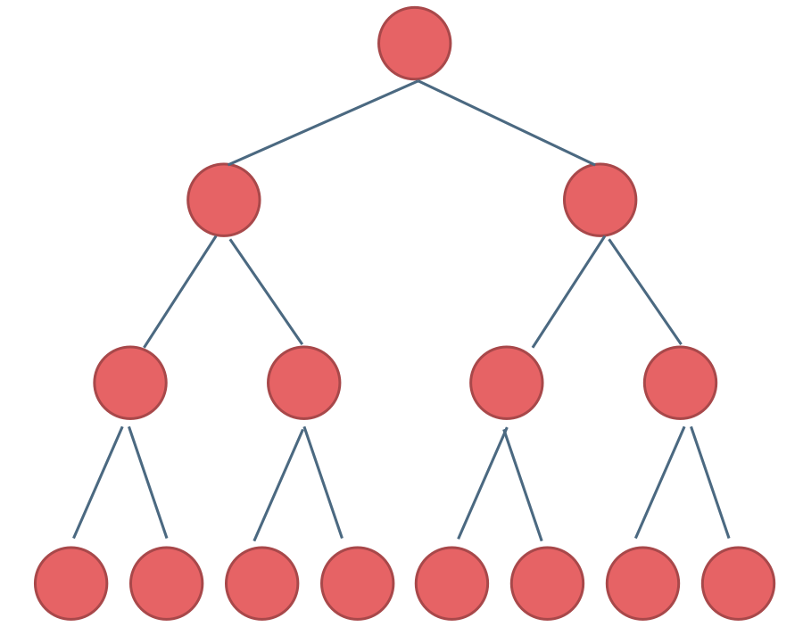
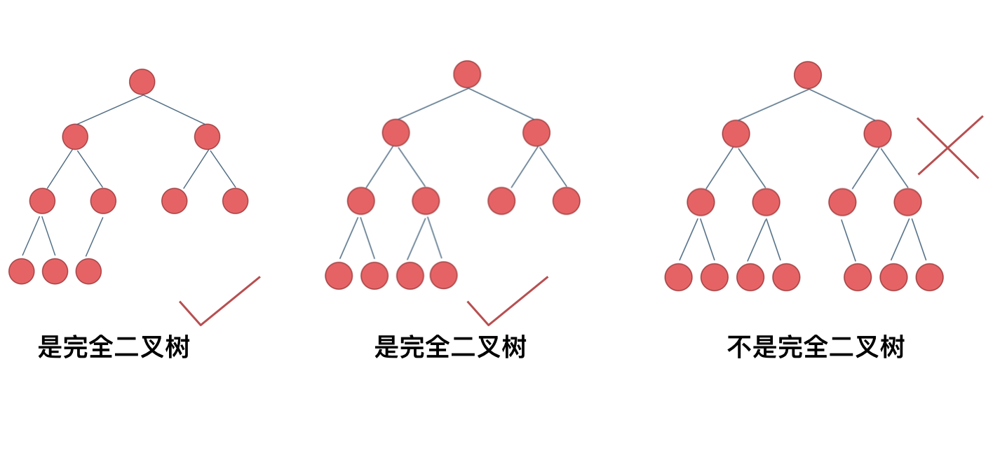
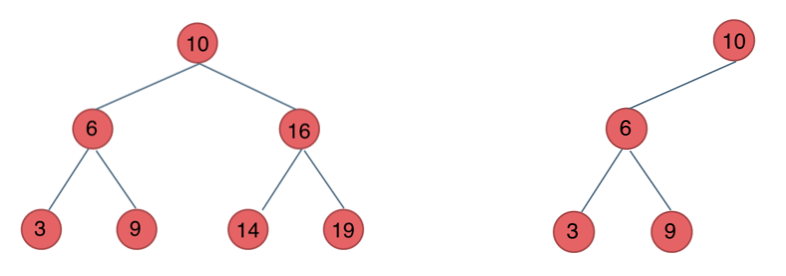

# 二叉树的种类


## 普通二叉树

一、树的概念和结构
1、树的概念
树是一种非线性的数据结构，它是由n（n>=0）个有限结点组成一个具有层次关系的集合。把它叫做树是因为它看起来像一棵倒挂的树，也就是说它是根朝上，而叶朝下的。

有一个特殊的结点，称为根结点，根节点没有前驱结点。
除根节点外，其余结点被分成几个互不相交的集合，每个集合又是一棵结构与树类似的子树。每棵子树的根结点有且只有一个前驱，可以有0个或多个后继。
因此，树是递归定义的。
如下图，A为整个树的根节点。而B，C，D可以看做子树的根节点，在下面分别长出三棵子树。




节点的度：一个节点含有的子树的个数，叫做该节点的度。
叶节点和终端节点：度为零的节点。
双亲结点或父节点：如图，C为G的父节点。
孩子节点或子节点：如图，G为C的子节点。
兄弟节点：拥有相同父节点的节点称为兄弟节点。
树的度：一棵树中最大的节点的度称为树的度。
节点的层次：从根开始定义起，根为第1层，根的子节点为第2层，以此类推。
树的高度或深度：树中节点的最大层次，如图，高度为4。
祖先：从跟到该节点所经分支上的所有节点。A是所有节点的祖先。
森林：由m（m>0）棵互不相交的树的集合称为森林。


**高度与深度**

高度：是从叶子结点起开始往上数层数，有多少层就是指该[二叉树](https://so.csdn.net/so/search?q=二叉树&spm=1001.2101.3001.7020)的高度是多少。

深度：是从根结点起开始往下数层数，有多少层就是指该二叉树的深度是多少。

**总结：在数值上高度和深度是相等的，但是表示的含义却不相同。**


## 满二叉树

满二叉树：如果一棵二叉树只有度为0的结点和度为2的结点，并且度为0的结点在同一层上，则这棵二叉树为满二叉树。

如图所示：



这棵二叉树为满二叉树，也可以说深度为k，有2^k-1个节点的二叉树。


## 完全二叉树

什么是完全二叉树？

完全二叉树的定义如下：在完全二叉树中，除了最底层节点可能没填满外，其余每层节点数都达到最大值，并且最下面一层的节点都集中在该层最左边的若干位置。若最底层为第 h 层，则该层包含 1~ 2^(h-1)  个节点。

**大家要自己看完全二叉树的定义，很多同学对完全二叉树其实不是真正的懂了。**

我来举一个典型的例子如题：



相信不少同学最后一个二叉树是不是完全二叉树都中招了。

**之前我们刚刚讲过优先级队列其实是一个堆，堆就是一棵完全二叉树，同时保证父子节点的顺序关系。**


## 二叉搜索树

前面介绍的树，都没有数值的，而二叉搜索树是有数值的了，**二叉搜索树是一个有序树**。

- 若它的左子树不空，则左子树上所有结点的值均小于它的根结点的值；
- 若它的右子树不空，则右子树上所有结点的值均大于它的根结点的值；
- 它的左、右子树也分别为二叉排序树

下面这两棵树都是搜索树 


**二叉搜索树的遍历**

使用中序遍历的二叉搜索树得到的数组是升序的。


## 平衡二叉树

平衡二叉搜索树：又被称为AVL（Adelson-Velsky and Landis）树，且具有以下性质：

1. 它是一棵空树或它的左右 **两个子树的高度差** 的绝对值 **不超过1** 

2. 左右两个子树都是一棵 **平衡二叉树** 。


如图：


最后一棵 不是平衡二叉树，因为它的左右两个子树的高度差的绝对值超过了1。


---


## 二叉树节点的定义


```java
public class TreeNode {
    int val;
  	TreeNode left;
  	TreeNode right;
  	TreeNode() {}
  	TreeNode(int val) { this.val = val; }
  	TreeNode(int val, TreeNode left, TreeNode right) {
    		this.val = val;
    		this.left = left;
    		this.right = right;
  	}
}
```


# 二叉树的遍历


二叉树的遍历分为两大类

**深度优先遍历** (递归)

* 前序遍历 -- 中左右

* 中序遍历 -- 左中右
* 后序遍历 -- 左右中

**广度优先遍历** （迭代）

* 层序遍历 -- 一行一行遍历


### 深度优先递归遍历

这里帮助大家确定下来递归算法的三个要素。**每次写递归，都按照这三要素来写，可以保证大家写出正确的递归算法！**

1. **确定递归函数的参数和返回值：** 确定哪些参数是递归的过程中需要处理的，那么就在递归函数里加上这个参数， 并且还要明确每次递归的返回值是什么进而确定递归函数的返回类型。
2. **确定终止条件：** 写完了递归算法, 运行的时候，经常会遇到栈溢出的错误，就是没写终止条件或者终止条件写的不对，操作系统也是用一个栈的结构来保存每一层递归的信息，如果递归没有终止，操作系统的内存栈必然就会溢出。
3. **确定单层递归的逻辑：** 确定每一层递归需要处理的信息。在这里也就会重复调用自己来实现递归的过程。

**以下以前序遍历为例：**

* **确定递归函数的参数和返回值**：因为要打印出前序遍历节点的数值，所以参数里需要传入vector来放节点的数值，除了这一点就不需要再处理什么数据了也不需要有返回值，所以递归函数返回类型就是void，代码如下：

```cpp
void traversal(TreeNode* cur, vector<int>& vec)
```

* **确定终止条件**：在递归的过程中，如何算是递归结束了呢，当然是当前遍历的节点是空了，那么本层递归就要结束了，所以如果当前遍历的这个节点是空，就直接return，代码如下：

```cpp
if (cur == NULL) return;
```

* **确定单层递归的逻辑**：前序遍历是中左右的循序，所以在单层递归的逻辑，是要先取中节点的数值，代码如下：

```cpp
vec.push_back(cur->val);    // 中
traversal(cur->left, vec);  // 左
traversal(cur->right, vec); // 右
```

单层递归的逻辑就是按照中左右的顺序来处理的，这样二叉树的前序遍历，基本就写完了，再看一下完整代码：

前序遍历：

```cpp
class Solution {
    public List<Integer> preorderTraversal(TreeNode root) {
        List<Integer> result = new ArrayList<Integer>();
        preorder(root, result);
        return result;
    }

    public void preorder(TreeNode root, List<Integer> result) {
        if (root == null) {
            return;
        }
        result.add(root.val);
        preorder(root.left, result);
        preorder(root.right, result);
    }
}
```


### 广度优先迭代遍历

二叉树的层序遍历中，需要一个队列来进行支持。

1. 将根节点加入队列中
2. 从队列中取出一个节点，然后按照顺序将这个节点左、右子节点加入队列
3. 重复2的动作，直到队列长度为0

**确定每层中的节点**

从第一层唯一一个的根节点开始算起，记录初始时的队列长度**len**，每一轮初始队列包含了这一层的所有节点。

可以使用for循环进行遍历。


```java
    public List<List<Integer>> levelOrderBottom(TreeNode root) {
        List<List<Integer>> res = new ArrayList<List<Integer>>();
        Deque<TreeNode> que = new LinkedList<TreeNode>();
        if(root != null){
            que.offer(root);
        } 
        while(!que.isEmpty()){
            List<Integer> lis = new ArrayList<Integer>();
            int len = que.size();
            for(int i = 0; i < len; i++){
                TreeNode cur = que.poll();
                lis.add(cur.val);
                if(cur.left != null){
                    que.offer(cur.left);
                }
                if(cur.right != null){
                    que.offer(cur.right);
                }
            }
            res.add(lis);
        }

        return res;

    }
```