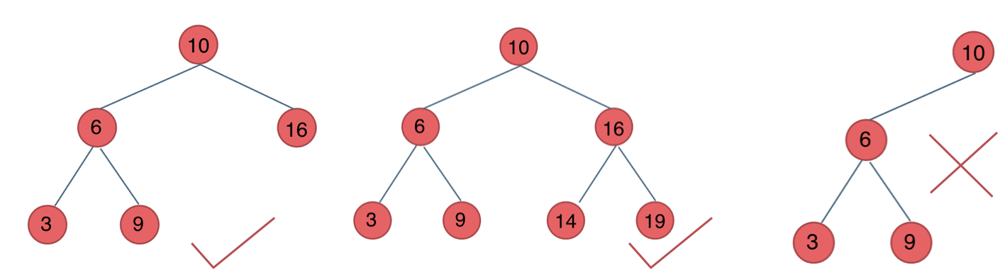
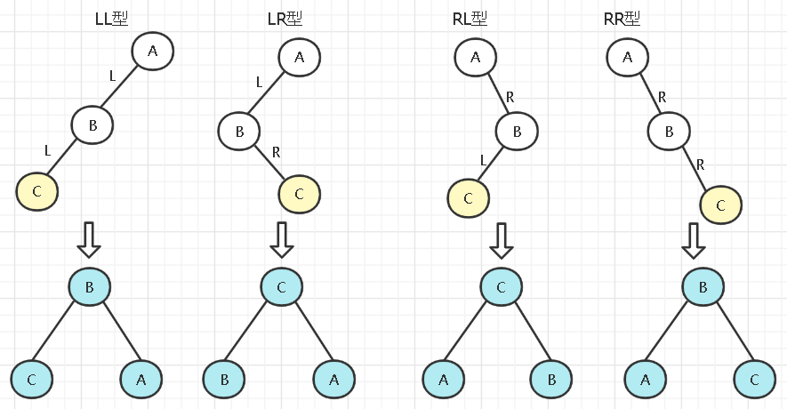
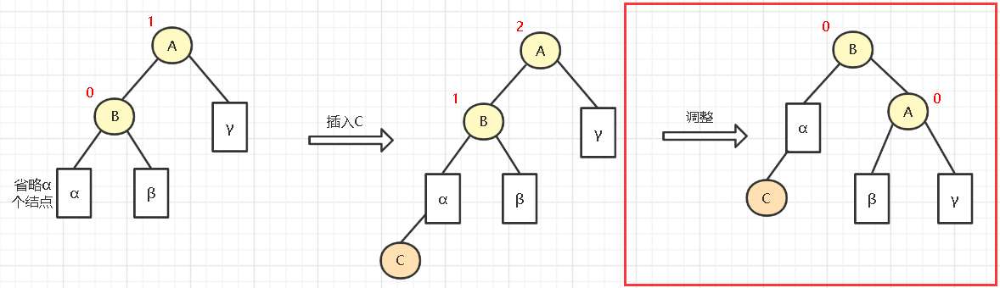
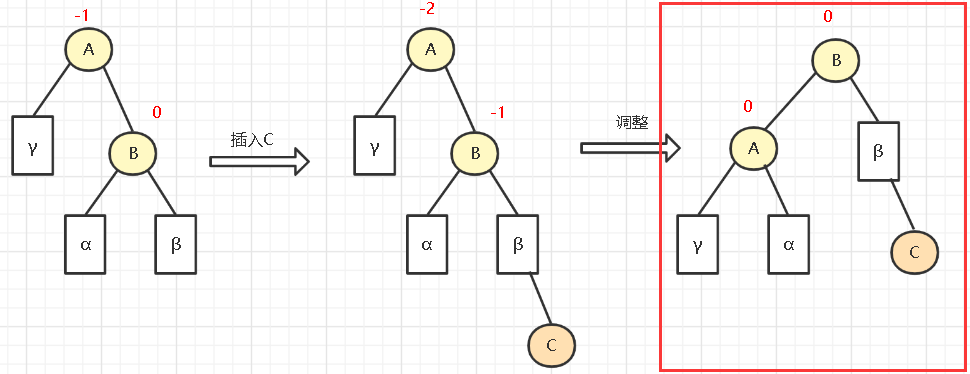
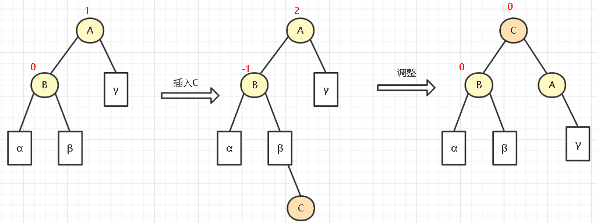
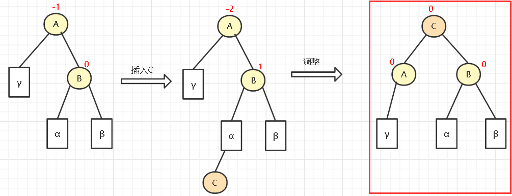

# 平衡二叉树

平衡二叉搜索树：又被称为AVL（Adelson-Velsky and Landis）树，且具有以下性质：

1. 它是一棵空树或它的左右 **两个子树的高度差** 的绝对值 **不超过1** 

2. 左右两个子树都是一棵 **平衡二叉树** 。

如图：

最后一棵 不是平衡二叉树，因为它的左右两个子树的高度差的绝对值超过了1。

## 平衡二叉树的构造

平衡二叉树的操作： **增加** 、 **删除** 、 **更改**、 **查询**。

查询直接根据二叉搜索树的方法即可。

根据一个点来先构造一个 **搜索二叉树** ， 然后通过中序遍历来得到一个 List 升序数列，然后二分法构造 平衡二叉树

## 平衡二叉树的调整

[(25条消息) 平衡二叉树_清风拂来水波不兴的博客-CSDN博客](https://blog.csdn.net/weixin_45902285/article/details/124517412)

3.1LL型调整
如下，在实际情况中，调整的内容可能看起来更复杂，如下方块的表示省略了n个结点，调整的方式如下(右旋)：

步骤为：

B结点带左子树(α和新添加的C结点)一起上升
A结点成为B的右子树
原来的B的右子树成为A的左子树，因为A的左子树是B，上升了，所以空着的
可以看成是A右旋为B的右子树

3.2RR型
LL型和RR型是最简单的几种情况，所以放在了前面。RR型即插入的结点位置在失衡结点的右子树的右子树中，如下图：

 调整的步骤和LL的差不多

步骤为：

B结点和它的右子树(β和新添加的C结点)一起上升
A结点变为B结点的左子树
原来B的左子树α变为A的右子树
可以看成是A左旋至B的左子树

3.3LR型调整
LR型的跳转如下(左旋再右旋)：

首先让B和它的子树(除了C)左旋至C的左子树，把C为根的树接入A的左子树
然后让A右旋，成为C的右子树 
其过程就是把中位数的C上升，成为AB的双亲

3.4RL型调整
RL型如下(先右旋再左旋)：

首先让B和它的子树(除了C)右旋至C的右子树，把C为根的树接入A的右子树
然后让A左旋，成为C的左子树 
和LR差不多

