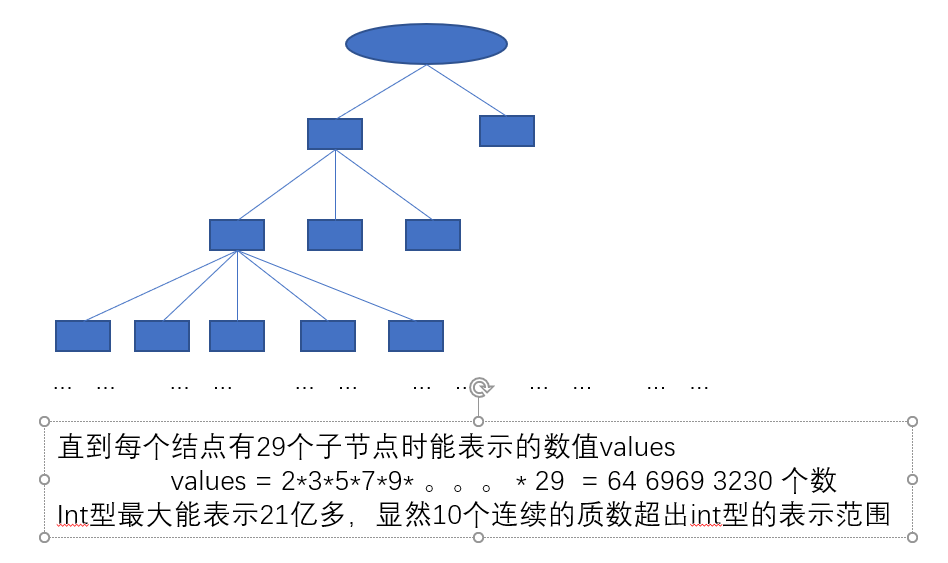
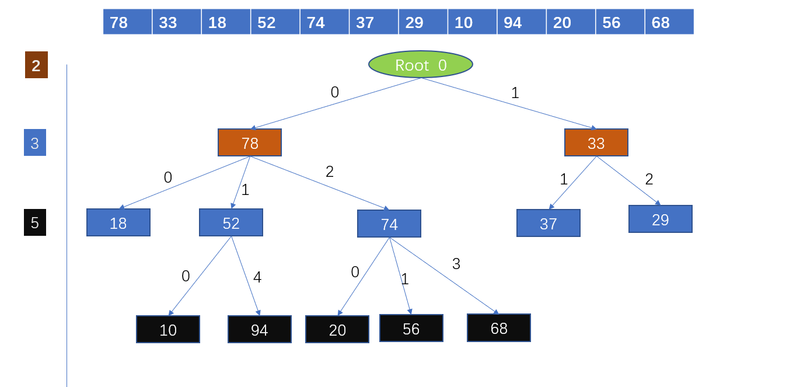

# 哈希树


## 质数分辨定理

简单的说就是，n个不同的质数可以分辨的连续数的个数和他们的乘机相同。分辨是指这些连续的整数不可能有相同的余数序列。



这21亿个数用29之前的质数去除，每一个数的余数序列都不同。


## 哈希树的构造


```java

 private static class Node{  //定义了一个内部类，每一个结点会有一个next数组  
        public Node[] next = null;    //用来装孩子的下标表示余数
        public Integer data = 0;        //数值
        public boolean isDel = false;   //是否被删除的标记
        public Node(Integer data,Integer level){    //构造函数
            next = new Node[level];
            this.data = data;
        }
        public Node(Integer data){    //构造函数
            this.data = data;
        }
    }
```


哈希树的插入方法：

​    宗旨：求余看对应位置的结点，如果为空则在空处插入一个新节点，如果被逻辑删除了替换值再逻辑恢复，如果有值就继续往下找，继续求余判断。

​    图解：有一组元素，按照顺序向hash树中插入元素，取余找位置插入。我们以下图中的 “68” 为例子, 假设前面的数字已经插入完成，68先对2取余得0，但是0位置上有人了，继续对3取余得2，2得位置上也有人了，那就继续对5取余得3，3得位置上没有人则插入 到3的位置。这样说是否清晰呢？



Hash树的查找方法：

​      也以上图中的68为例子，我们从2开始取余查找，找对应位置的值是否和它相同，不相同则继续向下取余，直到找到和68相同的数值或者直到为空为止。

  Hash树的删除算法：

​      与查找相同，查找到元素后，逻辑删除改变一下 isDel 的值即可。

  那么Hash树的基本操作就已经说完了，下面粘贴上源代码！

```java
/**
 * Created by 小H on 2018/3/25.
 */
public class MyHashTree {
 
    private static Integer[] PRIME_NUMBER = { 2 , 3 , 5 , 7 , 11 , 13 , 17 , 19 , 23 , 29}; //连续11个质数能表示6464693230个数字
 
    private Node root = new Node(0,PRIME_NUMBER[0]);
 
    /**
     * 插入一个元素
     * @param data
     * @return
     */
    public boolean insertData(Integer data){
        Integer count = 0;      //当前 要用的质数数组的下标   又可以标识层数   1层为树根 层数从2开始计算所以实际层数要+2
        Integer remain = 0;     //每次计算的余数
        Node point = this.root; //指针从根节点开始走
        while (true){
            remain = data % PRIME_NUMBER[count];        //计算余数
            if (point.next[remain] == null){   //余数位上为空新建一个结点加进去
                point.next[remain] = new Node(data,PRIME_NUMBER[count+1]);
                break;
            }else if(point.next[remain].isDel){ //或者是余数位上元素被逻辑删除了那么就把值给他替换信息然后逻辑恢复
                point.next[remain].data = data;
                point.next[remain].isDel = false;
                break;
            }else {                                //既不为空也不为逻辑删除那么我就继续找位置
                point = point.next[remain];
                count++;
            }
        }
        return true;
    }
 
    /**
     * 查询一个元素
     * 正常返回的应该是查询到的元素，这里就查个值，元素没有附带的信息也没什么好返回的，就瞎搞一下
     *
     * @param data
     * @return
     */
    public boolean serach(Integer data){
        Integer count = 0;      //当前 要用的质数数组的下标   又可以标识层数   1层为树根 层数从2开始计算所以实际层数要+2
        Integer remain = 0;     //每次计算的余数
        Node temp = null;       //一个引用，用来清晰的表示求余后指针余数位置上的元素
        Node point = this.root; //指针从根节点开始走
        while (true){
            remain = data % PRIME_NUMBER[count];    //计算余数
            temp = point.next[remain];              //描述余数位的结点
            if (temp != null){                      //结点不能为空为空就输出没找到
                if (!temp.isDel && data.equals(temp.data)){ //不为空的话就看相不相等，删没删除
                    System.out.println("层数：" + (count+2) + "         算上根节点的层数，当前结点所在的层数");
                    System.out.println("层数：" + (count+1) + "         不算根节点的层数，当前结点所在的层数");
                    System.out.println("值  ：" + point.next[remain].data);
                    System.out.println("质数：" + PRIME_NUMBER[count]);
                    System.out.println("余数：" + remain);
                    return true;
                }else {
                    point = point.next[remain];
                    count++;
                }
            }else if (point.next[remain] == null){
                System.out.println("没找到！");
                return false;
            }
        }
    }
 
    /**
     * 删除结点  逻辑删除
     * @param data
     * @return
     */
    public Boolean delData(Integer data){
        Integer count = 0;      //当前 要用的质数数组的下标   又可以标识层数   1层为树根 层数从2开始计算所以实际层数要+2
        Integer remain = 0;     //每次计算的余数
        Node temp = null;       //一个引用，用来清晰的表示求余后指针余数位置上的元素
        Node point = this.root; //指针从根节点开始走
        while (true){
            remain = data % PRIME_NUMBER[count];
            temp = point.next[remain];
            if (temp != null){
                if (!temp.isDel && data.equals(temp.data)){
                    System.out.println("=====结点信息输出======");
                    System.out.println("层数：" + (count+2) + "         算上根节点的层数，当前结点所在的层数");
                    System.out.println("层数：" + (count+1) + "         不算根节点的层数，当前结点所在的层数");
                    System.out.println("值  ：" + temp.data);
                    System.out.println("质数：" + PRIME_NUMBER[count]);
                    System.out.println("余数：" + remain);
                    System.out.println("========正在删除=======");
                    temp.isDel = true;
                    return true;
                }else {
                    point = point.next[remain];
                    count++;
                }
            }else if (point.next[remain] == null){
                System.out.println("没找到要删除的结点！");
                return false;
            }
        }
    }
 
    /**
     * 层序遍历输出值
     */
    public void showHashTree(){
        System.out.println("=========层序遍历开始=========");
        Node point = this.root; //指针从根节点开始走
        Node temp = null;
        MyLinkedQueue<Node> queue = new MyLinkedQueue<Node>();
        queue.enQueue(point);
        while (queue.getCount()>0){
            temp = queue.deQueue();
            if (temp.data == 0)
                System.out.println("根节点：" + temp.data);
            System.out.print(" " + temp.data + " ");
            for (int i = 0; i <temp.next.length ; i++) {
                if (temp.next[i] == null || temp.next[i].isDel )
                    continue;
                else {
                    queue.enQueue(temp.next[i]);
                }
            }
        }
        System.out.println();
        System.out.println("=========层序遍历结束=========");
    }
 
    private static class Node{
        public Node[] next = null;
        public Integer data = 0;
        public boolean isDel = false;
        public Node(Integer data,Integer level){
            next = new Node[level];
            this.data = data;
        }
        public Node(Integer data){
            this.data = data;
        }
    }
 
}
 

```


