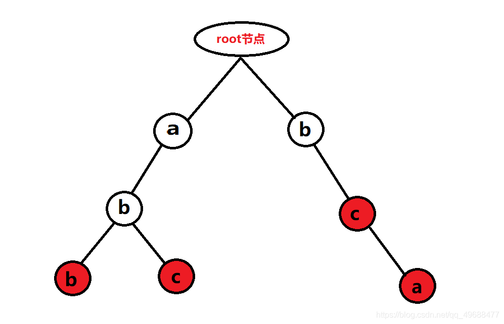
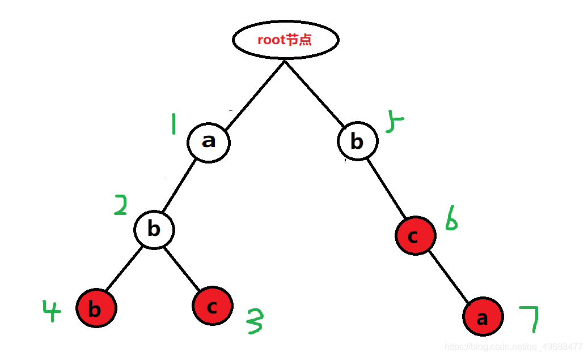

# 字典树

**问题概述**

给你n个单词,然后进行q次询问，每一次询问一个单词b，问你b是否出现在n个单词中，你会如何去求呢？

字典树的概念图

白色表示并不是字符串的结尾。

红色表示其是一个字符串的结尾。



**代码模板**

使用一个大的二维数组进行存储，N表示节点id,二维数组中的[26]表示 a-z

```java
const int N = 1000050;
int trie[N][26];
int cnt[N];
int id;

void insert(string s)
{
	int p = 0;
	for (int i = 0; i < s.size(); i++)
	{
		int x = s[i] - 'a';
		if (trie[p][x] == 0) trie[p][x] = ++id;
		p = trie[p][x];
	}
	cnt[p]++;
}

int  find(string s)
{
	int p = 0;
	for (int i = 0; i < s.size(); i++)
	{
		int x = s[i] - 'a';
		if (trie[p][x] == 0)return 0;
		p = trie[p][x];
	}
	return cnt[p];
}

```


这里我们用到了几个变量，这里分别一一解释
1.变量id： id代表字典树中每一个节点的编号，id的大小只与插入字典树的先后顺序有关，它的作用在下面会讲到。

2.trie[N][26]： 每个trie代表一条边，字典树其中1~N为边上方节点的编号，0代表root节点，1~26为连在i节点下方的26个字母。如果trie[i][x]=0,则代表字典树中目前没有这个点，而trie[i][x]的值代表这个点下方连有的点的编号，例如：trie[i][2]=9代表第i号点和的下方连有一个点‘c’，并且那个点的编号是9，为什么是c呢？因为 ‘c’-‘a’=2

3.cnt[N]: cnt[i]==0代表编号为i的点不是一个单词的结束点，在上面的图中代表这个点不是空点，但是没有标红，cnt[i]！=0代表编号为i的点是一个单词的结束点，即红点。cnt[i]不一定只为0或1，因为有可能多次输入了同一个单词。

4.（难点）两个函数中的变量p:
p代表查询与插入时的不断变化的当前节点编号，初始化为0，代表初始节点，在函数的循环中，我们首先用x确定接下来要找的字母，再通过变量x确定了接下来我们需要查找当前节点下是否有连接着目标字母的节点。通过每次确定的x，我们通过trie[p][x] 查找连着目标字母的节点的编号，如果目标节点存在，就把p更新成目标节点的编号（p = trie[p][x]）。而如果trie[p][x] == 0，代表字典树中没有这个点，如果是查找就代表没有这个单词，查找失败。而如果是插入函数，我们就用 ++id 来把这个点存进字典树。我们在两个函数的最后用cnt[p]来涂红节点或返回节点值。

我们先后插入单词"abc",“abb”,“bca”,“bc”，那编号就是这样



