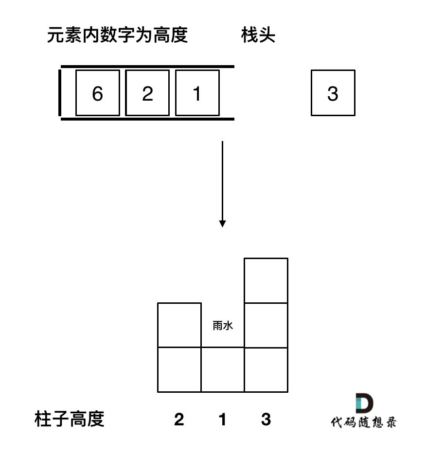

# 单调栈

[单调栈_今夜456的博客-CSDN博客_单调栈](https://blog.csdn.net/qq_59144780/article/details/122787827)

**通常是一维数组，要寻找任一个元素的右边或者左边或者两边第一个比自己大或者小的元素的位置，此时我们就要想到可以用单调栈了**。


## 基本原理

[42. 接雨水 - 力扣（LeetCode）](https://leetcode.cn/problems/trapping-rain-water/)

从接雨水的题目中来看单调栈如何应用


这道题目的需要找到 每个柱子 左右第一个比他大的柱子。



这时，栈低方向的元素是要大于栈头方向的元素，一直入栈，直到找到一个比栈头元素要大的元素。

这个时候，**栈头再前面一个元素**是**左面第一个大元素**，**将要入栈的元素**是**右边第一个大元素**。


因此，单调栈的代码模板如下：

```java
		if(height.length <= 2) return 0;
        int res = 0;
		//先准备一个栈并压入初始第一个元素
        LinkedList<Integer> stack = new LinkedList<Integer>();
        stack.push(0);
		
		//循环遍历所有元素入栈
        for(int i = 1; i < height.length; i++){
            //判断元素是否大于栈顶元素
            while(!stack.isEmpty() && height[i] > height[stack.peek()]){
                int out = stack.pop();
                if(!stack.isEmpty() && height[out]  < height[stack.peek()]){
                    res = res + (Math.min(height[i], height[stack.peek()]) - 
                                 height[out]) * (i - stack.peek() - 1);
                }
            }
            stack.push(i);
        }
        return res;

```


当然，如果要找到左右第一个比自己小的元素，那么将判断条件反转即可。

可以首先在给定的数组前后加上两个0，这样就可以防止空栈。

(一般来说题目要求正整数，不会比0更小，因此栈底的0不会出栈)


