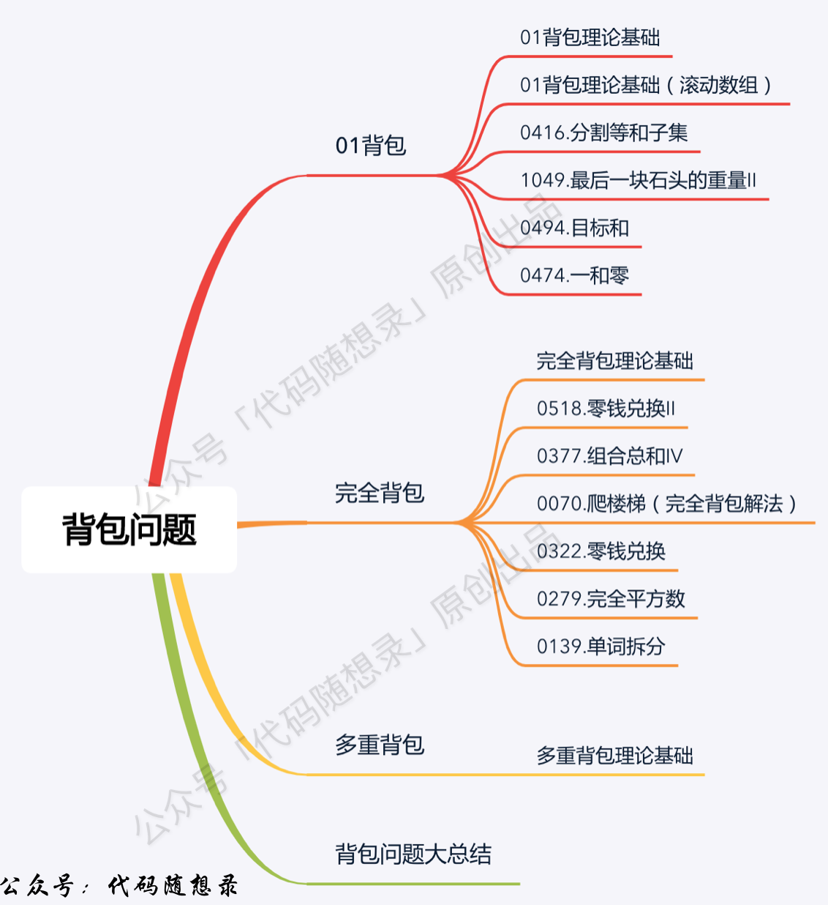
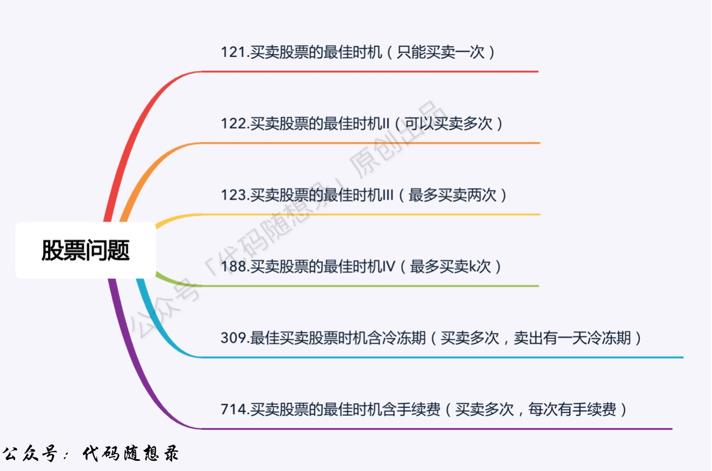
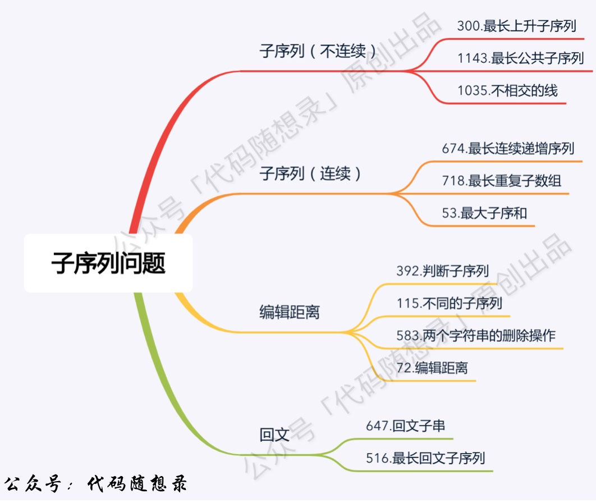

# 动态规划


## 动态规划基本 5 步骤


### 1.确定dp数组（dp table）以及下标的含义

dp数组，需要存储每一步的中间状态，通常这个dp数组最后一个数字即为我们要求得的最终值

因此，dp[i]表示的就是当参数等于i的时候本题的答案。

但dp[i]代表什么有时候并不能定死，因为有时候习题的答案有时候并不能总结出相应的递推公式。

也可能是dp数组存储着一系列中间状态(存在递推关系)，最终的结果是由中间结果进一步得到(无法直接得到递推关系)。


### 2.确定递推公式

**确定状态转移方程**

确定了dp[i]代表的含义之后，需要分析怎么才能得到dp[i]

尤其是dp[i] [j] 的时候，分析得到递推公式。

一般来说，初始化会从dp[0] [0] 开始， 到 dp[0] [j]  dp[i] [0].

也就是从左到右，从上到下， dp[i] [j] 很可能是从左边，上边或者左上的值得到。

**确定最终得到dp [i] [j]所需的所有变量**

一定要注意要得到dp[i] [j]所需要的所有变量，以及是否dp[i] [j]存在初始值

需要将多种得到 dp[i] [j] 的值加以比较的情况。


### 3.dp数组如何初始化

**哪些数据需要初始化**

需要根据状态转移方程，如果dp[i] 是根据dp[i - 1]得到，那么就需要初始化dp[0]

如果二维就需要初始化 dp[0] [j]


**需要初始化的数据要初始化成什么**

比如初始化dp[0], 先确定dp[1], dp[2]反推dp[0]

有时候dp[0]并没有什么实际意义，为了让dp[1]  dp[2]得到正确的值才需要初始化相应的值。

**使用Arrays.fill(arr, 0);**进行初始化数组


### 4.确定遍历顺序

在二维dp数组中比较重要，先遍历i还是先遍历j，遍历的方向是从左到右还是从右到左。


### 5.举例推导dp数组

一定要从dp[0]推导的dp[3] dp[4]自己试一试。


## 背包问题



背包问题中dp[i] [j] 中i 表示 物品的索引， j表示的是背包大小

**0-1背包** 表示每个物品只能使用一次  **完全背包** 中每个物品可以使用多次。  

### 0-1背包

先遍历 i 再遍历j

外层循环是 nums[i] 从小到大

内层循环是 target,从大到小

这样保证不会重复,因为：

```text
dp[j] = max(dp[j], dp[j - weight[i]] + value[i]);
```

所以如果正序遍历，后面需要用到的数据会被覆盖。


### 完全背包

**如果求组合数就是外层for循环遍历物品，内层for遍历背包**。

**如果求排列数就是外层for遍历背包，内层for循环遍历物品**。


## 打家劫舍

环形的打家劫舍，一定要分成两种情况，一种是不打头，一种是不打尾

树形的打家劫舍，要考虑每个节点的状态，分为未覆盖，已覆盖和打劫。


## 股票系列



dp[i] 表示的是手里的钱

最后一天股票在手里是没用的，不能算钱，所以手里的钱最大值等价于利润


## 子序列系列



dp[i] 表示 **包含i位置字符** 的最大子序列，一定要包含i，最后返回的值是dp数组中的最大值。


