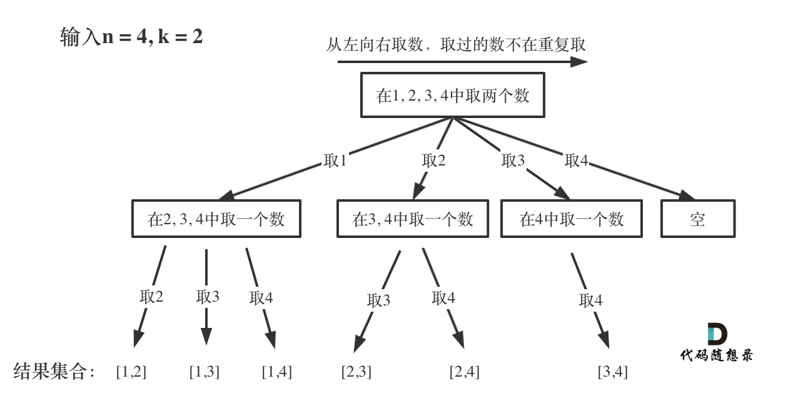
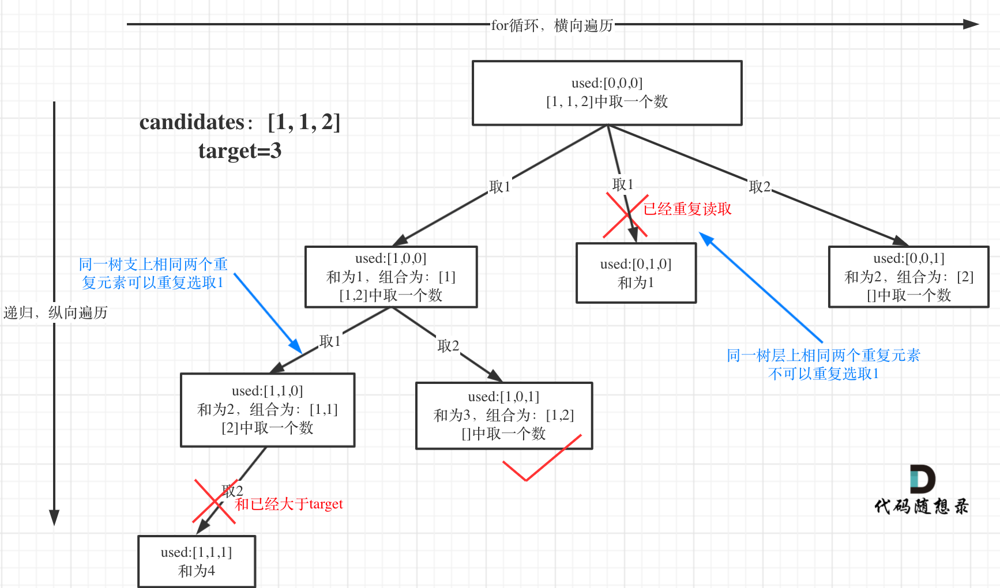
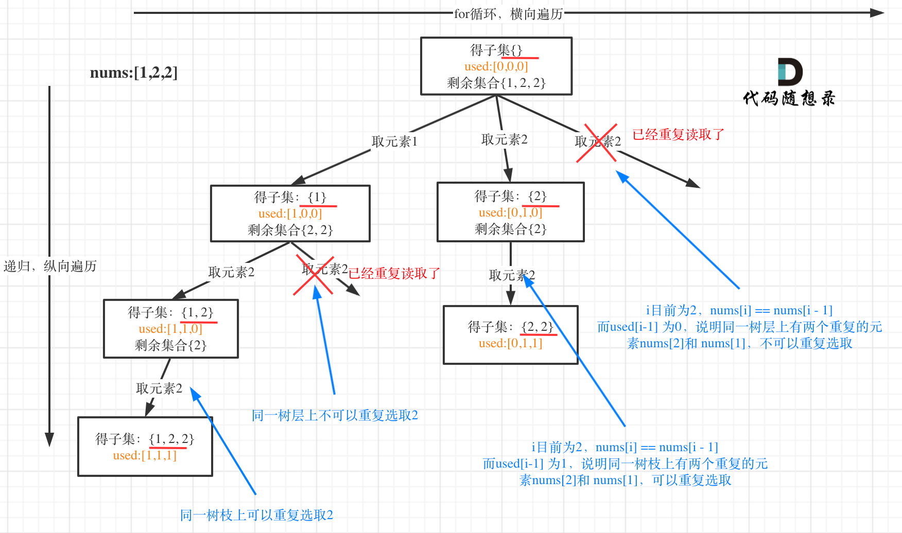
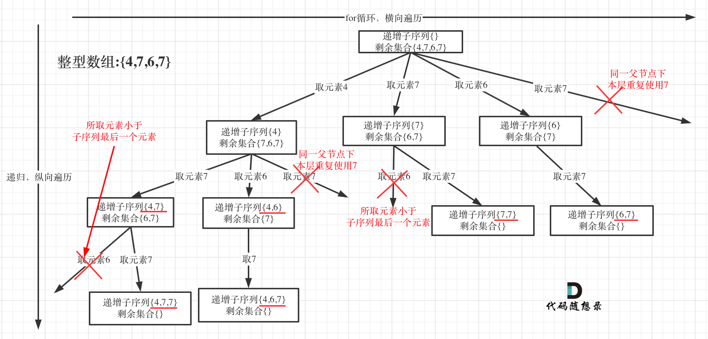
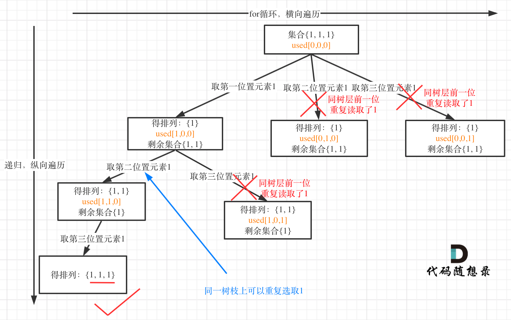

# 回溯算法

回溯算法一般适用于解决 多层for循环的情况，通常配合递归使用。

根据问题的不同要考虑每次递归的 **起始位置** 以及 **去重方法**

一般模板如下：

```java
class Solution {
    
    //使用 result 作为最终返回的结果
    //使用 path 存储过程值
    public List<List<Integer>> result = new ArrayList<List<Integer>>();
    public LinkedList<Integer> path = new LinkedList<Integer>();


    public List<List<Integer>> combine(int n, int k) {
        backtracking(n, k, 1);
        return result;
    }

    //回溯函数，首先包含原题目的参数，还要考虑是否需要包含递归循环的起始位置
    public void backtracking(int n, int k, int startIndex){
        //记录满足条件的结果
        //如果需要记录所有的结果，那么就不需要判断条件
        if(path.size() >= k){
            result.add(new ArrayList<Integer>(path));
            return;
        }
		//进行横向遍历的for循环
        for(int i = startIndex; i <= n - (k - path.size()) + 1; i++){
            path.push(i);
            //进行纵向遍历的递归
            backtracking(n, k, i+1);
            path.pop();
        }

        return;
    }


```


回溯算法需要考虑如何控制 for 循环和 递归

注意： 横向的for循环去重 不改变结果path的长度。 纵向递归遍历的去重则改变最终结果path的长度。


## 组合


[77. 组合 - 力扣（LeetCode）](https://leetcode.cn/problems/combinations/)

给定两个整数 `n` 和 `k`，返回范围 `[1, n]` 中所有可能的 `k` 个数的组合。

你可以按 **任何顺序** 返回答案。



组合问题需要按顺序找到所有组合，不涉及去重。

按照深度优先的算法， 只需要控制 回溯函数的 初始索引 startIndex即可。


[40. 组合总和 II - 力扣（LeetCode）](https://leetcode.cn/problems/combination-sum-ii/)

给定一个候选人编号的集合 candidates 和一个目标数 target ，找出 candidates 中所有可以使数字和为 target 的组合。

candidates 中的每个数字在每个组合中只能使用 一次 。





这个问题与前面问题不同的地方在于：

1. 给定的初始数组中具有重复的数
2. 在初始数组中取得重复的数都是相同的可以变换位置

这就表示，不同位置的 相同的值 1 是一样的，取哪个都行。

因此{1,1,1,2}中的所有解集必定包含所有{1,1,2}中的解集，并包含{1,2}中的解集。

而初始数组需要排序。

**这个题需要横向去重**

使用一个 int 的 used变量 存储 **上一次** 横向遍历 的值和本次比较，相同就continue。


---

## 子集



子集和组合的两个区别：

1. 子集需要记录整个树上所有的节点(**回溯函数一开始不需要判断**)
2. 横向去重

注意横向去重之前仍需要将原始数组排序。

如果使用int的情况下需要提前排序，如果使用数组，则不需要排序。

---

## 序列

[491. 递增子序列 - 力扣（LeetCode）](https://leetcode.cn/problems/non-decreasing-subsequences/)



与之前的问题不同，子序列问题中：

1. 原始数组不能重新排序
2. 仍然需要横向去重

不能排序的时候使用 int[] used 数组取中，而这个数组里存储的不是 **索引** ，而是 **值**

不是 **i** , 而是 **nums[i]**;

就表示不管i是多少，只要你值在之前取过，那就不行。


---

## 排列

[47. 全排列 II - 力扣（LeetCode）](https://leetcode.cn/problems/permutations-ii/)




全排列仍然需要对横向去重。

用used数组去重(不需要提前排序)；


棋盘(多维)


## 简要概括

### 组合

**组合题** 中的结果集合，每个结果中如果 **元素相同** 但是 **顺序不同** 仍然被判定为重复。

[ a, b, c, b ] 与[ a, b, b, c]是重复的。

因此需要先排序，然后加入 if(i > begin && candidates[i] == candidates[i-1] ) continue;


**去重原理**

首先要确定的是我们需要去重的是 **横向去重**

要理解一点： [1,1,1,2,3,4,5] 得到的答案 肯定包含了 [1,1,2,3,4,5].

因为前者比后者多一个数，后者所有组合的解肯定是要包含在前者中的。

(前者问题 第一步 **横向遍历** 的时候 **不选这个1** 不就是后者问题吗)


观察这个去重，[1,1,2]的横向去重：

同一树层( **横向遍历** )两个重复元素不可以重复选取。

那么for循环中(数组排序后的情况下)， 如果i > startIndex && candidates[i] == candidates [i - 1], 说明横向遍历肯定已经取过这个值了。

后面这个 candidates[i] == candidates [i - 1] 好理解，相同表示重复呗。


那么为什么是前面这个 **i > startIndex** 而不是 i > 0 呢？

如果只有i > 0 会导致 **纵向去重**。 [1,1,6]这个组合，第一层取完 1 ，第二层再取 1， 就会导致i > 0 然后被去重。

因此，我们要保证的是：i > 每层最开始的index 再开始去重。

(如果有used数组， i > startIndex 也可以替换成  **i > 0 && used[i - 1] == 0** )

这表示 i 前面的数 在这个for循环( **横向遍历** ) 中已经被抛弃了，因此后面相同的值不要再用了。


### 排列

排列就是 考虑元素顺序的组合。

组合问题 中 元素顺序不同也是一个解， 但排列问题中 是不同解。

因此排列不需要记录上一层横向遍历的索引startIndex, 每层for循环都是从 0 开始。

但是需要一个类变量 used[index] **索引数组** 来记录 所有位置的元素是否使用过。


同时，需要一个局部变量 usedValue[value] 值数组，来确定这一层是否已经使用过某个值。


**另一种横向去重方法**

**used[i] == 1 || ( i > 0 && nums[i] == nums[i - 1] && used[i - 1] == 0 )**  continue;

先对给定数组进行排序，然后判断 是否和前一个值相同(这一轮横向遍历是否出现过当前数) ，前一个值是否已经被使用(**used[i - 1] == 0** 说明这一层之前的遍历就已经选过这个数了)。 因此就不需要再选这个数了。


### 子集

子集 就是 集合， **没有任何要求** 的 集合

横向去重也参考 **组合**


### 序列

序列 也是 组合， 但是 1. **不能提前排序** 2. 结果仍然要 去重

1.使用set存 最终结果 然后转化为 List

2.每一层 新建一个 局部变量(注意不是类变量！) used数组存 **元素值！** 

要在for循环前 新建，整个for循环使用，并且不置0.

**( path.isEmpty() || nums[i] >= path.peekLast() )  && used[nums[i] + 100] == 0**

注意上面这个括号。

```java
int[] used = new int[201];
        for(int i = startIndex; i < nums.length; i++){
            if((path.isEmpty() || nums[i] >= path.peekLast()) && used[nums[i] + 100] == 0){
                path.offerLast(nums[i]);
                used[nums[i] + 100] = 1;
                backtracking(nums, i + 1);
                path.pollLast();
            }
        }
```


---

## 去重(重要！！！)

**提前排序**


**横向去重**

1.元素值的 used数组

for**循环前** 建立 **局部变量** used数组(used数组里保存的是元素的 **值** ，而不是 **索引** ！！！)

在for循环中，如果没遍历过就遍历然后 used[ nums[i] + 偏移量 ] = 1;  并且不再置0！

记住for循环表示的每一层


2.对给定数组排序 并 进行循环判断

 提前排序 +  **i > startIndex && candidates[i] == candidates [i - 1]**


**纵向去重**

传入上层递归的索引 startIndex


类变量 used数组， 存储索引值。


---

## 带记忆的回溯


